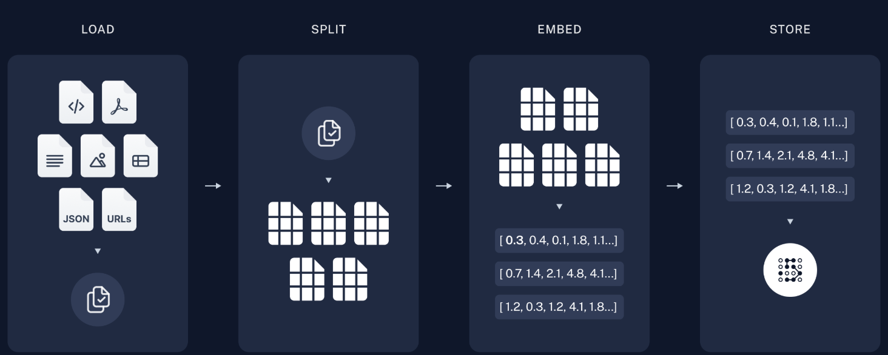
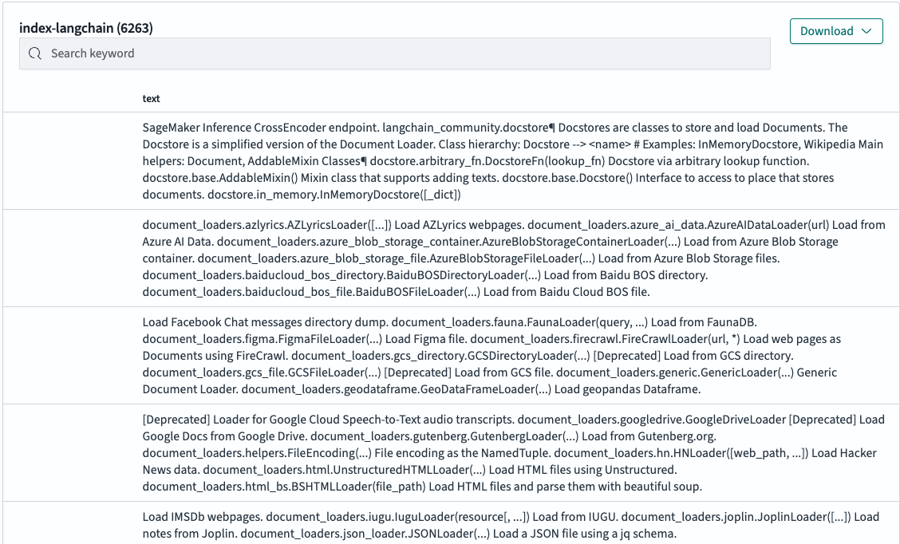

# LLM-Powered Document Chatbot with OpenSearch

This project implements a document-aware chatbot using two powerful LLM models:

- **Embedding Model**: `nomic-embed-text:latest` (via Ollama) for generating vector embeddings of documents.
- **Chatbot Model**: `amazon.titan-text-lite-v1` (via AWS Bedrock) for answering user queries based on indexed documents.

---

## 🧠 How It Works

1. **Document Ingestion**:
   - All documents are stored in the folder: `documents/latest/`.
   - Documents are loaded and split into chunks using:
     ```python
     RecursiveCharacterTextSplitter(chunk_size=600, chunk_overlap=50)
     ```
  - Stages related to how indexing works in LLM-based RAG applications can be seen as in the figure below:
    <p align="center">
      
    </p>

2. **Embedding**:
   - Each chunk is embedded using the `nomic-embed-text:latest` model via Ollama.
   - The resulting 768-dimensional vectors are validated and prepared for indexing.

3. **Indexing with OpenSearch**:
   - Embeddings are stored in an AWS-hosted OpenSearch vector database.
   - The index is named: `index-langchain`.
   - A total of 6263 document chunks are indexed.
   - As illustrated in figure below here you find the stage where documents are being pushed to the Opensreach db.
    <p align="center">
      
    </p>

4. **Chatbot Interaction**:
   - The chatbot uses `amazon.titan-text-lite-v1` to process user queries.
   - It retrieves relevant documents from OpenSearch and generates answers based on the indexed content.

---

## 🔧 Environment Configuration
Your `.env` file should include the following:

```bash
# AWS configuration
AWS_ACCESS_KEY_ID=""
AWS_SECRET_ACCESS_KEY=""
AWS_SESSION_TOKEN=""
AWS_REGION=""

# LLM configuration
OLLAMA_LLM_MODEL="nomic-embed-text:latest"
AWS_LLM_MODEL="amazon.titan-text-lite-v1"

# OpenSearch configuration
OPENSEARCH-HOST=""
OPENSEARCH-USERNAME=""
OPENSEARCH-PASSWORD=""
OPENSEARCH-INDEX-NAME="index-langchain"

# Define index and folder
documents_folder="./documents/latest/"
EMBEDDING_DIMENSION=768
```
---
## 📁 Project Structure

```bash
.
├── chatbot.py
├── documents
│   └── latest
│       ├── agents
│       ├── model
├── model
│   ├── __init__.py
│   ├── Bedrock.py
│   └── Ollama.py
├── pics
│   ├── 01.png
│   └── 02.png
├── requirements.txt
└── utils
    ├── __init__.py
    ├── Embadding.py
    ├── Opensearch.py
    └── Populate.py
```

## 🚀 Getting Started
1. Install dependencies:

```bash
pip install -r requirements.txt

```

2. Set up your .env file with the correct credentials and model names.

3. Run the chatbot using streamlit:
```bash 
streamlit run chatbot.py 
```