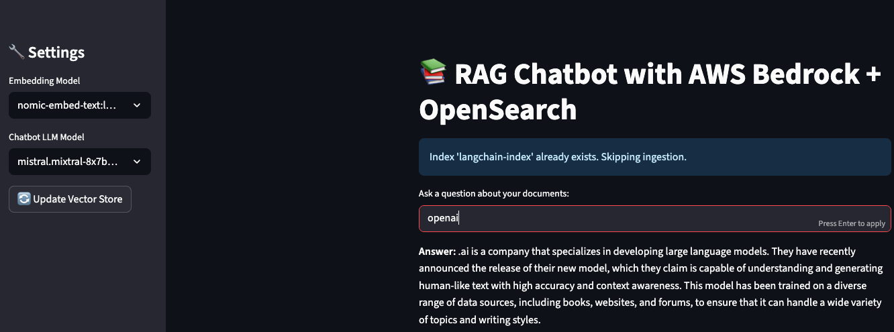

# LLM-Powered RAG Document Chatbot with OpenSearch

This project implements a RAG model which can answer the questions usign chatbot. The question are related to the documents which are converted as embadded vectore using `nomic-embed-text:latest` (via Ollama) and stored in ther `aws Opensearch vector db` and the chatbot is created using `mistral.mixtral-8x7b-instruct-v0:1` (via AWS Bedrock). This chain of events is illustrated in below:
    <p align="center">
      
    </p>

- **Embedding Model**: `nomic-embed-text:latest` (via Ollama) for generating vector embeddings of documents.
- **Chatbot Model**: `mistral.mixtral-8x7b-instruct-v0:1` (via AWS Bedrock) for answering user queries based on indexed documents.

---

## 🧠 How It Works

1. **Document Ingestion**:
   - All documents are stored in the folder: `documents/latest/`.
   - Documents are loaded and split into chunks using:
     ```python
     RecursiveCharacterTextSplitter(chunk_size=600, chunk_overlap=50)
     ```
  - Stages related to how indexing works in LLM-based RAG applications can be seen as in the figure below:
    <p align="center">
      
    </p>

2. **Embedding**:
   - Each chunk is embedded using the `nomic-embed-text:latest` model via Ollama.
   - The resulting 768-dimensional vectors are validated and prepared for indexing.

3. **Indexing with OpenSearch**:
   - Embeddings are stored in an AWS-hosted OpenSearch vector database.
   - The index is named: `langchain-index`.
   - A total of 6263 document chunks are indexed.
   - As illustrated in figure below here you find the stage where documents are being pushed to the Opensreach db.
    <p align="center">
      
    </p>

4. **Chatbot Interaction**:
   - The chatbot uses `mistral.mixtral-8x7b-instruct-v0:1` to process user queries.
   - It retrieves relevant documents from OpenSearch and generates answers based on the indexed content.
   - The final results from `streamlit` can be seen as in below:
       <p align="center">
      
    </p>

---

## 🔧 Environment Configuration
Your `.env` file should include the following:

```bash
# AWS configuration
AWS_ACCESS_KEY_ID=""
AWS_SECRET_ACCESS_KEY=""
AWS_SESSION_TOKEN=""
AWS_REGION=""

# LLM configuration
OLLAMA_LLM_MODEL="nomic-embed-text:latest"
AWS_LLM_MODEL="mistral.mixtral-8x7b-instruct-v0:1"

# OpenSearch configuration
OPENSEARCH-HOST=""
OPENSEARCH-USERNAME=""
OPENSEARCH-PASSWORD=""
OPENSEARCH-INDEX-NAME="langchain-index"

# Define index and folder
documents_folder="./documents/latest/"
EMBEDDING_DIMENSION=768
```
---
## 📁 Project Structure

```bash
.
├── backend/                  # Backend logic
│   ├── __init__.py
│   └── core.py              # Possibly core backend functions or API logic
├── chatbot.py               # Main chatbot interface or entry point
├── documents/               # Likely for storing or processing documents
│   └── latest/
│       ├── agents/          # Possibly agent configurations or logic
│       ├── model/           # Model-related files or outputs
├── model/                   # LLM model integrations
│   ├── __init__.py
│   ├── Bedrock.py           # AWS Bedrock integration
│   └── Ollama.py            # Ollama model integration
├── pics/                    # Image assets
├── README.md                # Project documentation
├── requirements.txt         # Python dependencies
└── utils/                   # Utility modules
    ├── __init__.py
    ├── Embadding.py         # Likely embedding logic (possibly typo: "Embedding")
    ├── Opensearch.py        # Integration with OpenSearch
    └── Populate.py          # Data population or ingestion logic
```

## 🚀 Getting Started
1. Install dependencies:

```bash
pip install -r requirements.txt

```

2. Set up your .env file with the correct credentials and model names.

3. Run the chatbot using streamlit:
```bash 
streamlit run chatbot.py 
```